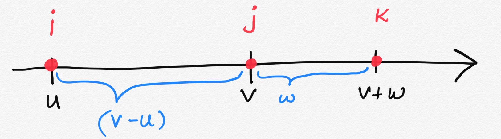
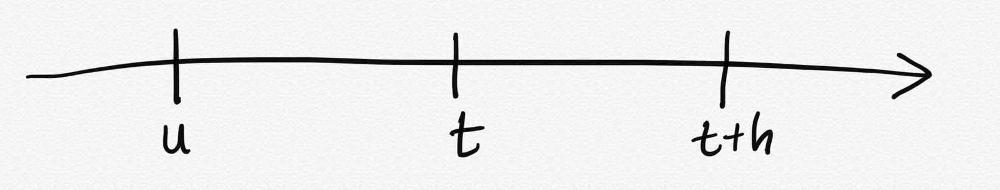

```{r,setup, include=FALSE}
knitr::opts_chunk$set(cache=TRUE)
```

## Continuous Parameter Markov Processes

1. Poisson process

2. Birth process

3. Death process

4. Birth-and-death process

---

## Recap: Definition of Continuous Parameter Markov Chains

Suppose that $\{N(t); t \geq 0\}$ is a **continuous-parameter discrete-state** stochastic process.  The process is called a **continuous parameter Markov chain** if for all $u, v, w > 0$ such that $0 \leq u < v$ and nonnegative integers $i, j, k$,

\begin{multline*}
P[N(v+w)=k|N(v)=j, N(u)=i, 0 \leq u < v]\\
= P[N(v+w) = k|N(v)=j].
\end{multline*}

---

## Recap: Definition of Continuous Parameter Markov Chains


If, in addition,

$$P[N(v+w)=k|N(v)=j]$$

is independent of $v$, then the continuous parameter Markov chain is said to have **stationary** or **homogeneous transition probabilities**.

---

## Q1: Show that Poisson process is a Markov Process.

We want to show that

\begin{multline*}
P[N(v+w)=k|N(v)=j, N(u)=i, 0 \leq u < v]\\
= P[N(v+w) = k|N(v)=j].
\end{multline*}

Let's start with LHS

\begin{multline*}
P[N(v+w)=k|N(v)=j, N(u)=i, 0 \leq u < v]\\
= \frac{P[N(v+w) = k, N(v)=j,  N(u)=i]}{P[N(v) = j, N(u)=i]}.
\end{multline*}

---

## Q1 (cont.)

In Poisson process there are no deaths. Hence, the only possibility that the event of  $[N(v+w)=k|N(v)=j, N(u)=i, 0 \leq u < v]$ could happen is


- $(k-j)$ events during $w$ period.

- $(j-i)$ events during $(v-u)$ period.

- $i$ events during $u$ period.




---

## Q1 (cont.)


\begin{multline*}
P[N(v+w)=k|N(v)=j, N(u)=i, 0 \leq u < v]\\
= \frac{P[N(v+w) = k, N(v)=j,  N(u)=j]}{P[N(v) = j, N(u)=i]}.
\end{multline*}


---

## Q1 (cont.)


Intervals that we are considering are mutually exclusive time intervals.


$P[N(v+w)=k|N(v)=j, N(u)=i, 0 \leq u < v] =\frac{P[N(v+w) -N(v) = k-j, N(v) - N(u)=j-i, N(u)-N(0)=i]}{P[N(v) = j, N(u)=i]}$

---

## Q1 (cont.)


By definition a Poisson process has **independent increments** and therefore we can write down the joint probabilities of these three events as the product of probabilities.

$P[N(v+w)=k|N(v)=j, N(u)=i, 0 \leq u < v] =\frac{P[N(v+w) -N(v) = k-j]P[N(v) - N(u)=j-i]P[N(u)-N(0)=i]}{P[N(v) = j, N(u)=i]}$


---

## Q1 (cont.)

Denominator can also be written based on the independent increment property

$P[N(v+w)=k|N(v)=j, N(u)=i, 0 \leq u < v] =\frac{P[N(v+w) -N(v) = k-j]P[N(v) - N(u)=j-i]P[N(u)-N(0)=i]}{P[N(v) - N(u) = j-i] P[N(u) - N(0)=i]}$

Simplifying the Equation we will get,


\begin{equation} \label{eq1}
\begin{split}
P[N(v+w)=k|N(v)=j, N(u)=i, 0 \leq u < v] = \\
P[N(v+w) -N(v) = k-j]
\end{split}
\end{equation}

---

## Q1 (cont.)

Now let's look at RHS of 

\begin{multline*}
P[N(v+w)=k|N(v)=j, N(u)=i, 0 \leq u < v]\\
= P[N(v+w) = k|N(v)=j].
\end{multline*}

---

## Q1 (cont.)


RHS

\begin{multline*}
P[N(v+w) = k|N(v)=j] = \frac{P[N(v+w)=k, N(v)=j]}{P[N(v)=j]}\\ =
\frac{P[N(v+w) - N(v)=(k-j), N(v)-N(0)=j]}{P[N(v)-N(0)=j]} \\ 
\text{(mutually exclusive time intervals)}
\end{multline*}

---

## Q1 (cont.)

Using the property of independent increments

\begin{multline*}
P[N(v+w) = k|N(v)=j] = \frac{P[N(v+w)=k, N(v)=j]}{P[N(v)=j]}\\ =
\frac{P[N(v+w) - N(v)=(k-j), N(v)-N(0)=j]}{P[N(v)-N(0)=j]} \\ 
\text{(mutually exclusive time intervals)} \\
=\frac{P[N(v+w) - N(v)=(k-j)] P[N(v)-N(0)=j]}{P[N(v)-N(0)=j]} \\ 
\text{(independent increments)} \\
\end{multline*}

---

## Q1 (cont.)

\begin{equation} \label{eq2}
\begin{split}
P[N(v+w) = k|N(v)=j] = 
P[N(v+w) - N(v) = k-j]
\end{split}
\end{equation}

From Eq 1 and 2 we prove that

\begin{multline*}
P[N(v+w)=k|N(v)=j, N(u)=i, 0 \leq u < v]\\
= P[N(v+w) = k|N(v)=j].
\end{multline*}

Hence, Poisson process is a "continuous parameter Markov chain".


---

## Q2: Show that the birth process is a Markov chain process.

We can use the definition itself to show that.



- $u$ - past

- $t$ - present

- $t+h$ - future time point 

---

## Q2 (cont)

Condition for Markov chain process

\begin{multline*}
\tiny
P[N(v+w)=k|N(v)=j, N(u)=i, 0 \leq u < v]\\
= P[N(v+w) = k|N(v)=j].
\end{multline*}

**Postulate of the birth process**

\begin{equation} \label{eq3}
\tiny
 P[N(t+h) = n+k|N(t)=n]=\left\{
    \begin{array}{ll}
      \lambda_n h + o(h), & \mbox{k=1}\\
      o(h), & k \geq 2 \\
      1-\lambda_n h + o(h), & k = 0 \\
    \end{array}
  \right.
\end{equation}

Suppose $N(u)=m$. There is no involvement of $u$ and $m$ in equation 3. Hence, by definition birth process is a markov process.


---

## Q2 (cont.)


**Postulate of the birth process**

\begin{equation} \label{eq3}
\tiny
 P[N(t+h) = n+k|N(t)=n]=\left\{
    \begin{array}{ll}
      \lambda_n h + o(h), & \mbox{k=1}\\
      o(h), & k \geq 2 \\
      1-\lambda_n h + o(h), & k = 0 \\
    \end{array}
  \right.
\end{equation}

Suppose $N(u)=m$. There is no involvement of $u$ and $m$ in equation 3. Hence, by definition birth process is a Markov process.


\begin{equation} \label{eq3}
\tiny
 P[N(t+h) = n+k|N(t)=n, N(u) = m]=\left\{
    \begin{array}{ll}
      \lambda_n h + o(h), & \mbox{k=1}\\
      o(h), & k \geq 2 \\
      1-\lambda_n h + o(h), & k = 0 \\
    \end{array}
  \right.
\end{equation}

---

## Distribution of length of stay

- Now we are going to look at the distribution of length of stay for birth process, death process, birth-and-death process.

- We have already looked at this property for the Poisson process. 

> Let's recap (Note 6)!

- Let $N(t)$ is a Poisson process with rate $\lambda$. We first generate i.i.d. random variables $T_n, n=1, 2, ..$, where $T_n \sim Exponential(\lambda)$. 

- $T_n$ denote the elapsed time between the $(n-1)^{st}$ and the $n^{th}$ event.


---

## Distribution of length of stay (cont.)


Poisson process is a continuous parameter Markov chain process. Furthermore, birth process, death process, birth-and-death processes are also continuous parameter Markov chain processes. If in general  the time elapsed between two consecutive occurrences of continuous parameter Markov chain processes follows exponential distribution, then we can say the time elapsed between two consecutive occurrences of  birth process/ death process/ birth-and-death processes also follows an exponential distribution.


---

- Let's try to understand the  distribution of length of stay of continuous parameter Markov chain processes.
    
- Before that let's look at some important facts about the exponential distribution.

---

## Important facts about the exponential distribution

**Fact 1**

 If $T \sim exp(\lambda)$, then $P(T > t+s|T>t) = P(T >s)$. This is called the **memoryless property**, also known as **lack of aging property** or **lack of memory**.

\textcolor{red}{\textbf{Exponential distribution} is the only continuous distribution with the memoryless property.}

\textcolor{blue}{\textbf{Geometric distribution} is the only discrete distribution with the memoryless property.}

<!--https://www.youtube.com/watch?v=3-UFi4T3w7c-->

---

## Important facts about the exponential distribution (cont.)

**Fact 2**

 If $T_i \sim exp(\lambda_i)$, where $i = 1, 2, ..., n$. Then $M = min(T_1, T_2, ..., T_n)$ has an exponential distribution with parameter $\sum_{i=1}^{n} \lambda_i$. That is, $M \sim exp(\sum_{i=1}^{n} \lambda_i)$.

**Fact 3**

If $T_i \sim exp(\lambda_i)$, where $i = 1, 2, ..., n$. Then,

$$P[T_j=min(T_1, T_2, ...T_n)] = \frac{\lambda_j}{\sum_{i=1}^{n}\lambda_i}.$$

---


## Important facts about the exponential distribution (cont.)

**Fact 4**

Suppose that $T_i \sim exp(\lambda_i)$. Let $k > 0$ and $T_2 = T_1 - k$. If $T_1 \geq k$, then $P(T_1 > t) = P(T_2 > t)$. 

---

## Revisit: Back to our problem!

Poisson process is a continuous parameter Markov chain process. Furthermore, birth process, death process, birth-and-death processes are also continuous parameter Markov chain processes. If in general  the time elapsed between two consecutive occurrences of continuous parameter Markov chain processes follows exponential distribution, then we can say the time elapsed between two consecutive occurrences of  birth process/ death process/ birth-and-death processes also follows an exponential distribution.

- **Let's try to understand the  distribution of length of stay of continuous parameter Markov chain processes.**
    
---

## Distribution of length of stay - Continuous parameter Markov chain processes


Suppose that a continuous-time time-homogeneous Markov chain $\{N(t): t \geq 0\}$ enters state $i$ at some time, (say at time $s \geq 0$)) and let $T_i$ denote the amount of time that the process stays in state $i$. Then, for any $u > 0$

$$P[T_i \geq u] = P[N(t)=i; s < t < s+u|N(s)=i)]$$ for any $s \geq 0$.


---

## Distribution of length of stay - Continuous parameter Markov chain processes (cont.)

Now for any $a, h \ge 0$,

\begin{align*}
\tiny
P[T_i \geq a+h|T_i \geq a] &= \frac{P[T_i \geq a+h]}{P[T_i \geq a]}\\
&= \frac{P[N(t)=i, s < t \leq s+a+h|N(s)=i]}{P[N(t) = i, s < t \leq s+a | N(s)=i]}\\
&= .\\
&= .\\
&= P[T_i \geq h] \\
\end{align*}

Your turn: Complete the intermediate steps.

---

This implies that $T_i$ has the memoryless property. A continuous random variable with exponential distribution has the memoryless property. Hence, $T_i$ must have an exponential distribution. 


$$T_i \text{ has memoryless property.} \Rightarrow T_i \text{ follows an exponential distribution.}$$

This result gives us another way of defining a continuous-time stationary Markov chain. 


---

## Definition 

A continuous parameter stationary Markov process 
is a stochastic process having the properties that

1. Each time it enters state $i$, the amount of time it spends in that state before making a transition into a different state is exponentially distributed (say with rate $\nu_i$ or mean $\frac{1}{\nu_i}$), and

2. When the process leaves state $i$, it enters state $j$ with some probability, $p_{ij}$ satisfying,

\begin{align*}
\tiny
P_{ii} &= 0 \text{ all } i\\
\sum_j P_{ij} &= 1 \text{ all } i \\
\end{align*}
