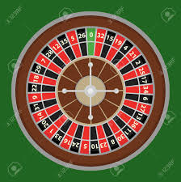

```{r,setup, include=FALSE}
knitr::opts_chunk$set(cache=TRUE)
```

## Definition: Discrete Parameter Markov Chain

Let $\{X_n; n = 0, 1, 2, ...\}$ be a stochastic process that takes on a finite or countable number of possible values. If $X_n=i,$ then the process is said to be in state $i$ at time $n$.

The discrete-parameter, discrete state stochastic process $\{X_n; n=0, 1, 2,...\}$ is called a **discrete-parameter Markov chain** if for all states $i_0, i_1,...i_{n-1}, i, j$ and all $n \geq 0$,


\begin{multline}
  P(X_{n+1}=j|X_n=i, X_{n-1}=i_{n-1}, ..., X_1=i_1, X_0=i_0) = \\  P(X_{n+1}=j|X_n=i).
\end{multline}

## Discrete Parameter Markov Chain (cont.)

\begin{multline}
  P(X_{n+1}=j|X_n=i, X_{n-1}=i_{n-1}, ..., X_1=i_1, X_0=i_0) = \\  P(X_{n+1}=j|X_n=i) \tag{1}
\end{multline}

This means, for a Markov
chain, the conditional distribution of any **future state** $X_{n+1}$, given the **past states**
$X_0, X_1,...X_{n-1}$ and the **present state** $X_n$, is independent of the past states and depends only on the present state.

<!--depends only on the immediately past one x_{i-1} and affects only the susequent one x_{i+1}-->

## Markov chain: Example

Three white balls and two black balls are distributed in two urns in such a way that
first urn contains two balls. In a game, one ball is drawn randomly from the first urn and then
placed it in the second urn. Then a ball is drawn randomly from the second urn and placed it
in the first urn. This concludes one game. The game is repeated. Let Xn denote the number of
white balls in the first urn after the nth game. ($X_0$ denotes the state at the beginning).
What are the parameter space and state space? Is $\{X_n\}$ a Markov chain?

## One-step transition probabilities

We have a set of states, $S = \{i_0, i_1, i_2,...i_{n-1}, i, j\}$. The process starts in one of these states and moves successively from one state to another. Each move is called a **step**.

\begin{multline}
P_{nij} = P(X_{n+1}=j|X_n=i, X_{n-1}=i_{n-1}, ..., X_1=i_1, X_0=i_0)  \\ = P(X_{n+1}=j|X_n=i)
\end{multline}

If the chain is currently in state $i$, then
it moves to state $j$ at the next step with a probability denoted by $p_{nij}$ , and this
probability does not depend upon which states the chain was in before the current state.

The probabilities $p_{nij}$ are called one-step transition probabilities.


## One-step transition probability (cont.)

Let $\{X_n; n \in N\}$ be a Markov chain and

$p_{nij} = P(X_{n+1}=j|X_n=i)$

When $p_{nij}$ does not depend on $n$ (when the process is time-homogeneous), one step-transition probability can be written as

$p_{ij} = P(X_{n+1}=j|X_n=i)$ for all $n \in N$.


## One-step transition probability (cont.)

The process can remain
in the state it is in, and this occurs with probability $p_{ii}$.

Note:

$$p_{i,i} = p_{ii}$$

$$p_{1,2} = p_{12}$$

But do not write

$$p_{1,10} = p_{110}$$


## One-step transition probability matrix

Let $P$ denote the matrix of one-step transition probabilities $P_{ij}$, so that

$$P = \left[\begin{array}{cccccccc}
p_{00} & p_{01} & p_{02} & ...\\
p_{10} & p_{11} & p_{12} & ...\\
. & . & . & ...\\
p_{i0} & p_{i1} & p_{i2} & ...\\
. & . & . & ...
\end{array}\right]$$

Since probabilities are nonnegative and since
the process must make a transition into some state, we have

$p_{ij} \geq 0,$ for $i, j \geq 0$, $\sum_{j=0}^\infty p_{ij} = 1,$ for $i = 0, 1, ...$


## One-step transition probability matrix (cont.)

$$P = \left[\begin{array}{cccccccc}
p_{00} & p_{01} & p_{02} & ...\\
p_{10} & p_{11} & p_{12} & ...\\
. & . & . & ...\\
p_{i0} & p_{i1} & p_{i2} & ...\\
. & . & . & ...
\end{array}\right]$$

Row index denotes the state at a given instant and column index refers to the state at next instant.

## Example: Transition probability matrix^[Introduction to Probability Models, Sheldon M. Ross]

Suppose that the chance of rain tomorrow
depends on previous weather conditions only through whether or not it is
raining today and not on past weather conditions. Suppose also that if it rains
today, then it will rain tomorrow with probability $\alpha$; and if it does not rain today,
then it will rain tomorrow with probability $\beta$. 

Is this a Markov chain process?

<!--This is a two-state Markov chain process-->


## Example 1: Transition probability matrix

If we say the the process is in state 0 when it rains and state 1 when it does
not rain, the transition probability matrix is

## Example 2: Transition probability matrix

Suppose that a taxi driver operates between Wijerama and Nugegoda. If the driver is in Wijerama the probability that he gets a trip to Nugegoda from one passenger or a group of travelling together is 0.2 and that for him to get a trip nearby Wijerama is 0.8. If the driver is in Nugegoda he has equal chance of getting a trip to Wijerama or nearby Nugegoda. The behaviour of the driver evolves over time in a probabilistic manner. 

## Example 2: Pictorial map of the process

## Example 2: Transition probability matrix


## Example 3^[Introduction to Probability Models, Sheldon M. Ross]

Suppose that whether
or not it rains today depends on previous weather conditions through the last two
days. Specifically, suppose that if it has rained for the past two days, then it will
rain tomorrow with probability 0.7; if it rained today but not yesterday, then
it will rain tomorrow with probability 0.5; if it rained yesterday but not today,
then it will rain tomorrow with probability 0.4; if it has not rained in the past
two days, then it will rain tomorrow with probability 0.2.

Is this a Markov chain?


Example 3 (cont.)  
-------

**Transforming a Process into a Markov Chain**

\begin{columns}
\begin{column}{0.6\textwidth}
\begin{table}[]
\begin{tabular}{llll}
Yesterday & Today & Tomorrow  & Probability \\
1 & 1 & 1 & 0.7 \\
0 & 1 & 1 & 0.5 \\
1 & 0 & 1 & 0.4 \\
0 & 0 & 1 & 0.2 
\end{tabular}
\end{table}
\end{column}
\begin{column}{0.2\textwidth}
 \textcolor{red}{Transition probability matrix (in-class)} 
\end{column}
\end{columns}


\textcolor{blue}{state 0: if it rained both today and yesterday,}

\textcolor{blue}{state 1: if it rained today but not yesterday,}

\textcolor{blue}{state 2: if it rained yesterday but not today,}

\textcolor{blue}{state 3: if it did not rain either yesterday or today.}

## Example 4:  Gambler’s Ruin Problem



## Example 4:  Gambler’s Ruin Problem

Consider a gambler who takes only $50 to gamble with. He decided to play roulette. At each spin, he places $25 on red. If red occurs, he wins $25. If black comes up, he loses his $25. Therefore the odds of winning are 50%. 

He will stop playing when he is either has zero money left, or is up $25 ($75 total).

Let's model this process as a Markov chain. Obtain the transition probability matrix.

<!--https://www.youtube.com/watch?v=afIhgiHVnj0-->

Example 4:  Gambler’s Ruin Problem (cont.)
-------

\begin{columns}
\begin{column}{0.5\textwidth}
 Draw the transition diagram.
\end{column}
\begin{column}{0.5\textwidth}
 Transition probability matrix
\end{column}
\end{columns}

## Absorbing states

- Once entered they are never left.


## Example 5:

Consider a random walk on the finite states $\{-2 -1, 0, 1, 2\}$. If the process
is in state $i (i = -1, 0, 1)$ at time $n$, then it moves to either $i -1$ or $i + 1$ at time $n + 1$ with
equal probability. If the process is in state -2 or 2 at time $n$, then it moves to state -1, 0, or
1 at time $n + 1$ with equal probability.

Write the transition probability matrix for this process.

## Example 6

Suppose a virus can exist in N different strains enumerated $\{1, . . . , N\}$ and
in each generation either stays the same, or with probability α mutates to another strain,
which is chosen at random.

## Random walk

A random walk is a special kind of Markov chain. In a random walk, the states are all
integers. Negative numbers are (sometimes) allowed. Say you start in a state $a$. The one-step transitions are that, with probability $p$, you move to state $a + 1$ and with probability
$q = 1 − p$, you move to state $a − 1$. The largest move you can make per transition is one
step in either direction, and there is no probability of remaining in the same state.

Write the transition probability matrix.

## Random walk with restricted range

State space = $\{a, -2, -1, 0, 1, 2, b\}$

$a$ - absorbing barrier

$b$ - reflecting barrier

## Estimating transition probabilities

- In the absence of a theoretical model to estimate probabilities, it is necessary to collect data and use them to estimate transition probabilities.

- Statistical methods

    - Relative frequency approach
    
    - Maximum likelihood estimation
    
    - Survival analysis
    
    - Bayesian estimation approaches, etc.
    
## Example: Markov chain model of single-stranded DNA


\begin{columns}
\begin{column}{0.5\textwidth}
\textbf{Suppose we have obtained 7 DNA segments}
\text{}
 AAACCCTGGGCAATTCAGT
 AAAACCCGTAAAGTTAC
 CAAAGGTATAAAAC
 TTCCAAGAGAGA
 AAGAGATATAACAGATCA
 CCCGCTCACGCGGGT
\end{column}
\begin{column}{0.5\textwidth}
\begin{table}[!h]
\begin{tabular}{|l|l|l|l|l|l|}
\hline
 & A & C & G & T & $N_i$ \\ \hline
A &  &  &  &  &  \\ \hline
C &  &  &  &  &  \\ \hline
G &  &  &  &  &  \\ \hline
T &  &  &  &  &  \\ \hline
$N_j$ &  &  &  &  &  \\ \hline
\end{tabular}
\begin{tabular}{|l|l|l|l|l|}
\hline
 & A & C & G & T  \\ \hline
A &  &  &  &   \\ \hline
C &  &  &  &   \\ \hline
G &  &  &  &   \\ \hline
T &  &  &  &   \\ \hline
\end{tabular}
\end{table}
\end{column}
\end{columns}


## Problems ^[Introduction to Probability Models, Sheldon M. Ross]

- Example 4.3 

Chapter 4: Exercises

- Question 1

- Question 2

- Question 3

- Question 4

## Chapman - Kolmogrorov Equations


Next Week

Reading: Chapter 4: Section 4.2 
