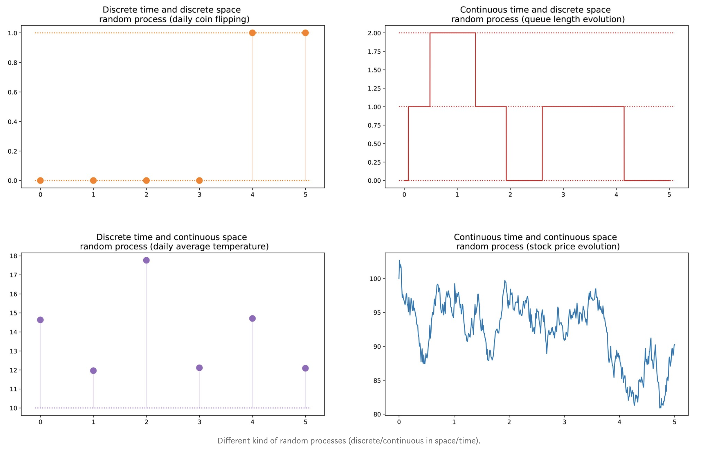

```{r,setup, include=FALSE}
knitr::opts_chunk$set(cache=TRUE)
```

## Goals

1. Explain the Markov property in the continuous-time stochastic processes.

2. Explain the difference between continuous time and discrete time Markov chains.

3. Learn how to apply continuous Markov chains for modelling stochastic processes.

## Stochastic Processes


parameter = time

source: https://towardsdatascience.com/

## Continuous Parameter Markov Chains

Suppose that we have a continuous-time (continuous-parameter) stochastic process $\{N(t); t \geq 0\}$ taking on values in the set of nonnegative integers. The process $\{N(t); t \geq 0\}$ is called a **continuous parameter Markov chain** if for all $u, v, w > 0$ such that $0 \leq u < v$ and nonnegative integers $i, j, k$,

\begin{multline*}
P[N(v+w)=k|N(v)=j, N(u)=i, 0 \leq u < v]\\
= P[N(v+w) = k|N(v)=j].
\end{multline*}

## Continuous Parameter Markov Chains (cont.)

In other words, a continuous-time Markov chain is a stochastic process having the Markovian property that the conditional distribution of the future $N(v+w)$ given the present $N(v)$ and the past $N(u)$, $0 \leq u < s,$ depends only on the present and is independent of the past.

If, in addition,

$$P[N(v+w)=k|N(v)=j]$$

is independent of $v$, then the continuous parameter Markov chain is said to have **stationary** or **homogeneous transition probabilities**.


## Discrete Time versus Continuous Time (In class)

diagram

\vspace{6cm}

DTMC: Jump at discrete times: 1, 2, 3, ...

CTMC: Jump can occur at any time $t \geq 0$.


## Transition Probabilities

Recap: $P_{ij}^n$ - transition probability of discrete Markov chains


### Transition probability of continuous Markov chains

$$p_{ij}(t, s)=P[N(t)=j|N(s)=i], \text{ s < t}.$$

- If the transition probabilities do not explicitly depend on $s$ or $t$ but only
depend on the length of the time interval $t-s$, they are called
**stationary** or **homogeneous**.

- Otherwise, they are nonstationary or nonhomogeneous.

- We'll assume the transition probabilities are stationary (unless stated
otherwise).

## Homogeneous transition probabilities

$$p_{jk}(w) = P[N(v+w)=k|N(v)=j]$$

$p_{jk}(w)$ represents the probability that the process presently in state $j$ will be in start $k$ a time $w$ later.

## Poisson Process

Let $N(t)$ be the total number of **events** that have occurred up to time $t$. Then, the stochastic process $\{N(t); t \geq 0\}$ is said to be a Poisson process with rate $\lambda$ if

1. $N(0) = 0$,

2. The process has independent increments,

3. For any $t \geq 0$ and $h \rightarrow 0_+$,

\begin{math}
 P[N(t+h)-N(t) = k]=\left\{
    \begin{array}{ll}
      \lambda h + o(h), & \mbox{k=1}\\
      o(h), & k \geq 2 \\
      1-\lambda h + o(h), & k = 0 \\
    \end{array}
  \right.
\end{math}


- The function $f(.)$ is said to be $o(h)$ if $lim_{h\rightarrow 0}\frac{f(h)}{h}=0.$

- The third condition implies that the process has stationary increments.

## Theorem

Suppose $\{N(t); t \geq 0\}$ is a Poisson process with rate $\lambda$. Then $\{N(t); t \geq 0\}$ is a Markov process.

\vspace{5cm}

## Theorem

Suppose that $\{N(t); t \geq 0\}$ is a Poisson process with rate $\lambda$. Then, the number of events in any interval of length $t$ has a Poisson distribution with mean $\lambda t$. That is for all $s, t \geq 0$,

$$P[N(t+s)-N(s)=n]=\frac{e^{-\lambda t}(\lambda t)^n}{n!}$$
For a Poisson process with rate $\lambda$, the transition probability $p_{ij}(t)$ is given by

$$p_{ij}(t)=\frac{e^{-\lambda t} (\lambda t)^{j-i}}{(j-i)!}$$

## Acknowledgement

The contents in the slides are mainly based on Introduction to Probability Models by Sheldon M. Ross.
