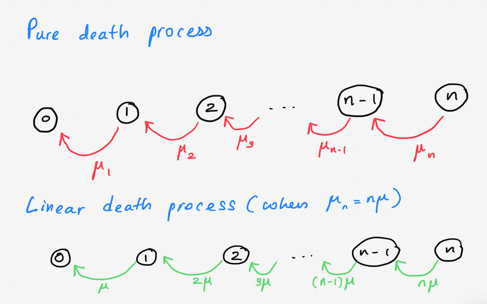

```{r,setup, include=FALSE}
knitr::opts_chunk$set(cache=TRUE)
```

---

## Pure Death Process

- Individuals persist only until they die and there are no births. 

- We assume initially, there are $n_0$ number of individuals at time $t=0$.

---

## The state transition diagram.




---

## Pure Death Process

Let us consider a death process whose total number of individuals at time $t$ is denoted by a discrete random variable $N(t)$. As parameter $t$ varies $\{N(t): t\geq 0\}$ represent a stochastic process with a continuous parameter space and a discrete state space.

We assume that the individuals of a death process with initial size $n_0$ die at a certain rate, which depends on the present size of the population eventually reducing the size to the zero. 

---

## Pure Death Process


**Condition 1**

\begin{math}
\tiny
 P[N(t+h) = n-k|N(t)=n]=\left\{
    \begin{array}{ll}
          1-\mu_n h + o(h), & k = 0 \\
      \mu_n h + o(h), & \mbox{k=1}\\
      o(h), & k \geq 2. \\
    \end{array}
  \right.
\end{math}

where $\mu_n$ is the rate at which the births occur at time $t$ and $n$ being the size of the population at time $t$. 


**Condition 2**

$N(0) = n_0$

---

## Notation

Let $N(t)$ be the number of individuals alive at time $t$. Suppose initially, there are $n_0$ individuals, that is $N(0) = n_0$.


$$P_n(t) = P[N(t) = n]$$


---

## Linear Death Process

Suppose $\mu_n = n\mu$, and initially,  $N(0) = n_0$.

Then we can show that,

$$N(t) \sim  Binomial (n_0, p)$$

where $p = e^{-\mu t}$. That is,

$$P_n(t) = \frac{n_0!}{(n_0 - n)!n!}(e^{-\mu t})^{n}(1-e^{-\mu t})^{n_0 - n},$$

for $0 \leq n \leq n_0$.

---

## Question 1

Suppose that a population has an average death rate of $\mu_n$. Let $P_n(t)$ be the probability that there are $n$ individuals in the population at time $t$. Assume that initially, there are $n_0$ number of individuals at time $t=0$. Derive the following system of differential equations for $P_n(t)$.

$P'_{n_0}(t) = -\mu_nP_n(t)$ and

$P'_n(t) = -\mu_n P_n(t) + \mu_{n+1}P_{n+1}(t)$ for $0 \leq n < n_0.$

Note: These system of differential equations can be solved subject to the conditions $P_{n_0}(0)=1$ and $P_n(0)=0$ for $0 \leq n < n_0.$

Hint: You can obtain a system of differential equations similar to the pure birth process. 

---

## Question 2: Linear Death Process - PMF

When $\mu_n = n\mu$, i.e. when the death rate is linear in the present size of the population, the pure death process is said to be a **linear death process**. Let us assume that there are $n_0$ individuals in the population initially. 

i) When $\mu_n = n\mu$, obtain the system of differential equations of the linear death process.

ii) Based on the system of differential equations show that


$$P_n(t) = \frac{n_0!}{(n_0 - n)!n!}(e^{-\mu t})^{n}(1-e^{-\mu t})^{n_0 - n},$$

for $0 \leq n \leq n_0$.

---

## Question 3: The mean and variance of the pure death process

Show that the mean of the pure linear death process is 

$E(N(t)) = n_0 e^{-\mu t}$ 

and the variance is 

$V(N(t)) = n_0 e^{-\mu t}(1-e^{-\mu t}).$

---

## Question 4: Extinction

In the pure death process the population either remains constant or it decreases. It may eventually reach zero in which case we say that the population has gone **extinct**. Show that the probability the population is extinct at time $t$ is given by

$$P(N(t)=0|N(0)=n_0)= (1-e^{-\mu t})^{n_0}.$$

<!--https://books.google.lk/books?id=q2XxDwAAQBAJ&pg=PA360&lpg=PA360&dq=%22Use+this+expression+to+show+that+extinction+is+inevitable%22&source=bl&ots=i5grJ6M2Px&sig=ACfU3U2IJZ3QBuGL760RRam2eEqb7ljB4A&hl=en&sa=X&ved=2ahUKEwiksa3OjvfsAhX0zzgGHaVMBhsQ6AEwAXoECAEQAg#v=onepage&q=%22Use%20this%20expression%20to%20show%20that%20extinction%20is%20inevitable%22&f=false-->